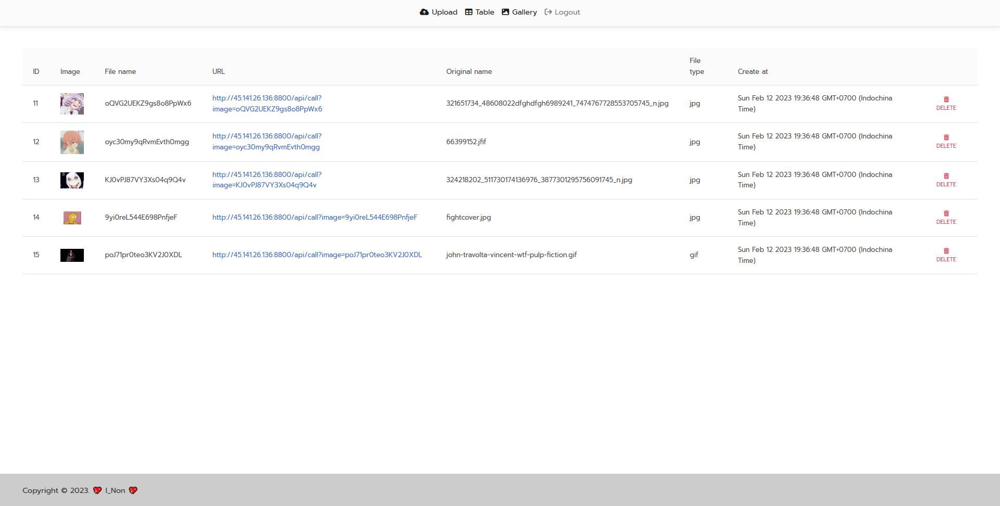
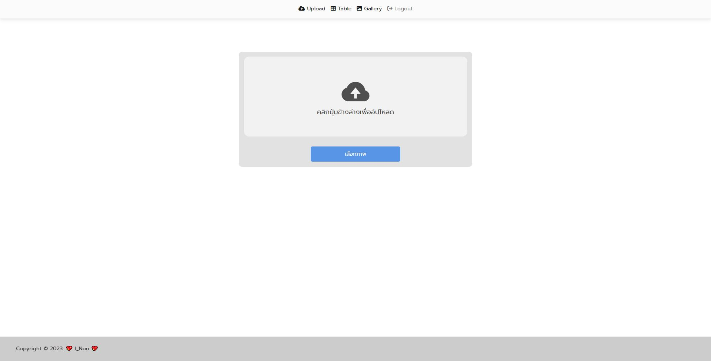
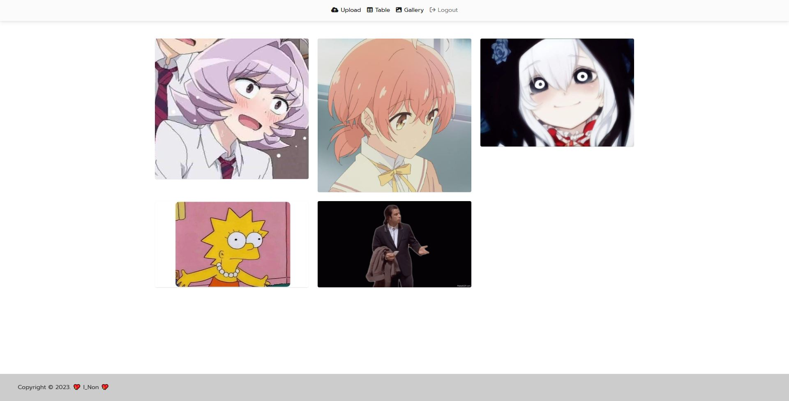
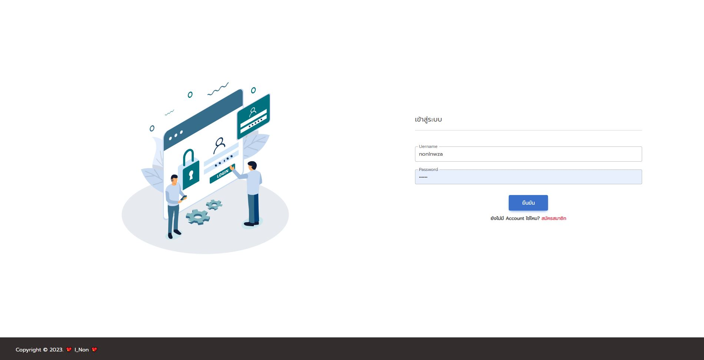

<h1>Image Gallery Project</h1>

 ก็เเค่เอาไว้อัปโหลดภาพเเล้วมันจะเก็บไว้ที่ Server ให้นั้นเเหละ 

 อย่างเวลาอยากส่งหรือเอาไปใชบนเว้ปจะได้ใส่ SRC ด้วย URL ภาพพอ 

 

<h1> เเละก็ขี้เกียจลบ password database เหมือนเดิม  LOL </h1>